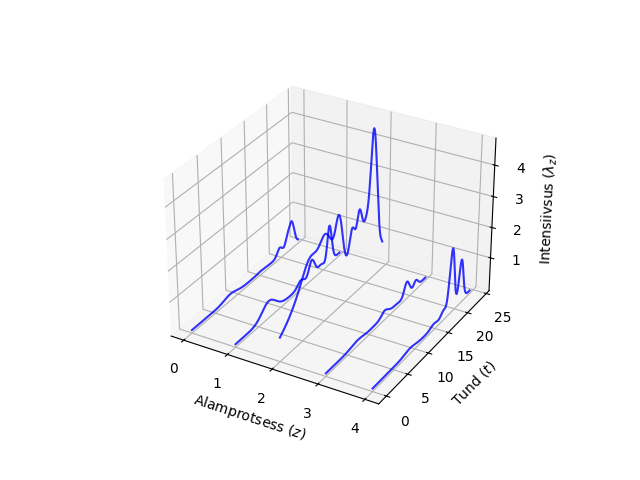
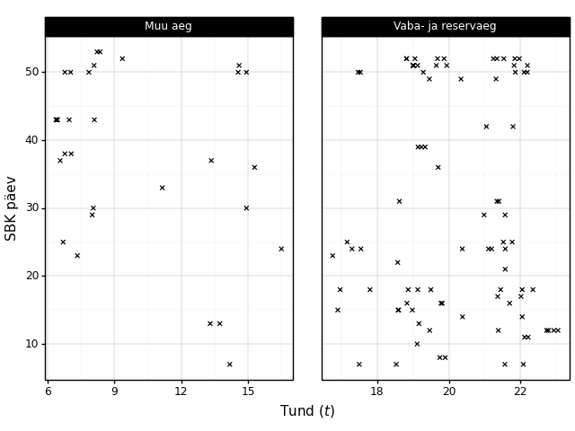

# Spioonid
Sõduri baaskursuse aegsete spioonide esinemise modelleerimine mittehomogeense Poissoni liitprotsessina

## Mudel
Põhineb [Goulding et al](http://www.cs.nott.ac.uk/~pszgss/goulding2016event_preprint.pdf). Valminud mudel koosneb Z-ist mittehomogeensest Poissoni portsessist, millest kõigi intensiivsusfunktsioonid on K kaalutud normaaljaotuse summad.

## Andmed
Mudel põhineb andmetel, mis on kogutud 2023 juulist kuni septembrini viiekümne liikmelise õpperühma igapäevaste tegevuste käigus.

